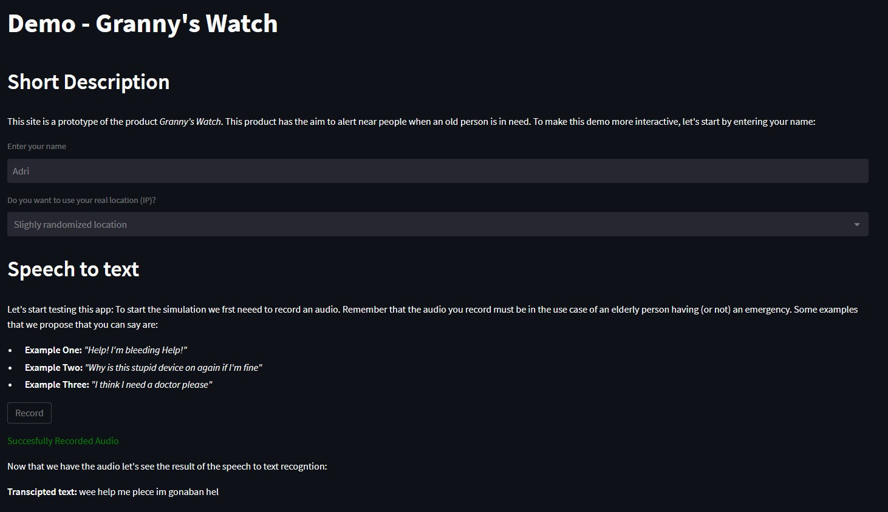
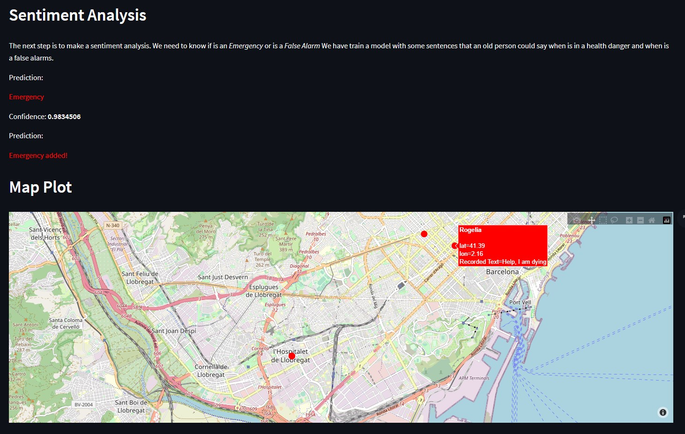

# Granny's Watch

## Background

Granny's Watch exists to be able to detect when an elderly person's health is in immediate danger. 

The Proof Of Concept is a WebApp which, based on a voice message, can detect when a person is in danger. Once detected, a marker is placed on a map, so that someone nearby can provide medical support until the ambulance arrives. In addition, a message is sent to people nearby, children or relatives, to go running. 

In future iterations, the idea is that instead of being a web app it will be available on smart watches. So that the user experience can be notified as quickly as possible to emergencies and people nearby.

## Usage

In order to be able to use the code, a Python version of 3.10 is required to ensure correct operation. It is recommended to create a virtual environment and install the requirements.txt dependencies. Once this is done run the following command (need to run the backend with flask and the frontend with streamlit):

```shell
    pip install -r requirements.txt
    flask run
    streamlit run main_app.py
```





## Acknowledgments 

This project has been realized thanks to Adrian Saiz, Andreu Vall, Danilo Mašić and Oriol Saguillo.

## License

- [Apache License 2.0](https://opensource.org/licenses/Apache-2.0)

## Contact info

> awatchdata2022@gmail.com
